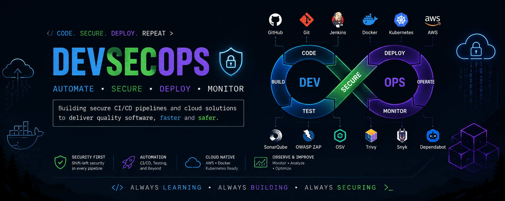

  

# Hi, I'm Himani 👋

### DevSecOps | Cloud Security | Software Engineering

I'm a 3rd-year student interested in building secure and automated
software delivery systems.

## 🔐 Currently Working On

### SecureDeploy
A DevSecOps platform that integrates:

- GitHub Pull Requests
- Jenkins CI/CD
- SonarQube
- OSV dependency scanning
- Security scorecards
- Docker
- AWS deployment
- Authentication & RBAC
- Admin deployment approval

## 🛠️ Tech Stack

**Languages**
- Python
- C++ / Java

**DevSecOps**
- Git
- GitHub
- Jenkins
- Docker
- SonarQube
- OSV

**Cloud**
- AWS
- IAM

**Backend**
- FastAPI
- PostgreSQL

## 📚 Currently Learning

- Data Structures & Algorithms
- Linux
- AWS
- DevSecOps
- Cloud Security
- CI/CD

## 🚀 Projects

🔐 **SecureDeploy**  
DevSecOps security and deployment platform.

🛡️ **GitHub PR Security Bot**  
Automated security analysis for pull requests.

⚙️ **Secure CI/CD Pipeline**  
Jenkins pipeline integrating testing and security scanning.

## 🎯 Goals

- Build strong DevSecOps projects
- Become placement-ready in DSA
- Learn cloud security
- Build production-oriented systems
- Contribute to open source
<!--
**himanidhawan-cloud/himanidhawan-cloud** is a ✨ _special_ ✨ repository because its `README.md` (this file) appears on your GitHub profile.

Here are some ideas to get you started:

- 🔭 I’m currently working on ...
- 🌱 I’m currently learning ...
- 👯 I’m looking to collaborate on ...
- 🤔 I’m looking for help with ...
- 💬 Ask me about ...
- 📫 How to reach me: ...
- 😄 Pronouns: ...
- ⚡ Fun fact: ...
-->
